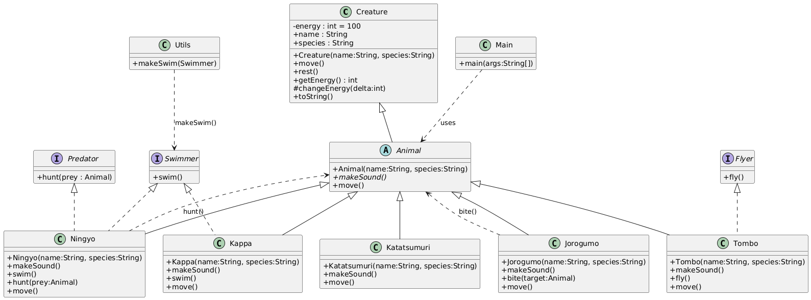

# Java Creatures (Créatures de la mythologie japonaise)

Petit projet Java qui montre des classes `Animal` adaptées de créatures de la mythologie japonaise,
avec héritage, interfaces et polymorphisme.

Fichiers présents:

- `src/Animal.java`
- `src/Kappa.java`
- `src/Ningyo.java` — implémente `Swimmer` et `Predator`
- `src/Tombo.java`
- `src/Jorogumo.java`
- `src/Katatsumuri.java`
- `src/Swimmer.java`, `src/Flyer.java`, `src/Predator.java`
- `src/Utils.java` (utilitaire `makeSwim`)
- `src/Main.java`

Diagramme

- Source PlantUML : `src/diagram.puml`
- Rendu (PNG) :



Exemple de sortie attendue (partielle) :

```
René fait : kwa kwa ! (kappa croak)
Michelle fait : glou glou (ningyō)
Jacques fait : zzzzz (libellule)
Suzuna fait : sss... (jorogumo)
Alfred fait : ... (silence d'escargot)
René va nager via Utils.makeSwim()
René énergie avant nage: 100
René nage et éclabousse.
René énergie après nage: 94
Michelle va nager via Utils.makeSwim()
Michelle énergie avant nage: 100
Michelle nage en ondulant gracieusement.
Michelle énergie après nage: 96
René avant piqûre : 94
Suzuna pique René !
René après piqûre : 88
Alfred énergie avant déplacement: 100
Alfred se déplace très lentement en laissant une trace de mucus.
Alfred énergie après déplacement: 99
Michelle énergie avant chasse: 96
René énergie avant d'être chassé: 88
Michelle attire puis attaque René !
René énergie après chasse: 58
Michelle énergie après chasse: 100
```

Notes détaillées

- Modèle d'énergie

  - Chaque créature a une énergie comprise entre `0` et `100`.
  - `move()` / `swim()` / `fly()` / `bite()` / `hunt()` ajustent l'énergie via `changeEnergy(delta)`.
  - `rest()` restaure `+20` d'énergie (max 100).

- Coûts et comportements (par espèce)

  - `Kappa` (grenouille/kappa)

    - Son: `"kwa kwa ! (kappa croak)"`
    - `swim()`: cost `-6` (affiche "nage et éclabousse").
    - `move()`: redirigé vers `swim()` (se déplace en nageant).

  - `Ningyo` (poisson mythologique)
